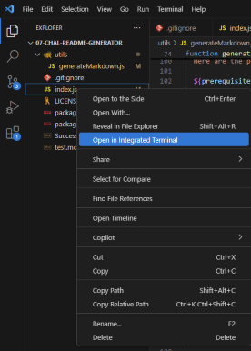

  # EZREADME Generator
  
  
  
  ## About

  The EZREADME Generator is an easy-to-use application that utilizes backend tools to retroactively create a README file that is tailored to the users needs based on the information provided. When started, the EZREADME Generator will prompt the user with a series of questions regarding details about the application the README file is meant for, including what the title is, a description of the application, steps to start and use the project, and more. Once all questions are answered, EZREADME Generator will create a file formatted in markdown syntax with all the information it is provided.
   

   
  ## Table of Contents 
  - [Installation](#installation)
  - [Usage](#usage)
  - [Contributing](#contributing)
  - [Tests](#tests)
  - [License](#license)
  - [Questions](#questions)
   

   
  ## Installation
   
  Here are the prerequisites necessary to use the project:
   
  1. Nodejs
  2. NPM
  3. Inquirer package

  
  To get started with the project, follow these steps:
   
  1. Visit nodejs's website [here](https://nodejs.org/en/download) to download nodejs.
  2. Open the terminal in your code editor and run the code ` node -v ` to check if node has been installed.
  3. NPM should be automatically installed alongside node. To make sure, run the code ` npm -v ` in the terminal.
  4. Finally, npm is used to install inquirer. As it is a dependency already listed in the repositories *package.json* file, simply run the code ` npm i `, and this will be installed.

   

   
  ## Usage 
   
  Here are the steps to start the application:
   
  1. Open an integrated terminal for the index.js file as shown below: 

      

     *via VSCode*
  
   2. Run the code ` node index.js ` in the terminal

   

  To use the application, do the following:

  Once the application is started, it will ask you a series of questions starting with “What is the title of the project?” Type out your answer, then press enter. From there it will continue asking you for information, enter the information as you please then press enter when satisfied. Prompts will accept answers typed in markdown formatting.
    
  > For more information on markdown formatting, visit the [Markdown Cheat Sheet](https://www.markdownguide.org/cheat-sheet/).
  
  On the license question, where it gives you a set of choices to choose from, use the arrow keys to navigate between choices, and press enter when you have your choice highlighted.  
  
  For questions asking you to “list steps separated by a pipe” simply place this character “ | “ between each step. Once finished, the application will number the steps and separate them by line. If no pipe is included, the application will format the information as a normal paragraph. 
  For example, step 1 | step 2 | step 3 will format as: 
  1. step 1
  2. step 2
  3. step 3  
    
  
  **Follow this video tutorial for a visual step by step guide on starting and using the application**: [Tutorial](https://drive.google.com/file/d/1zRhgsP6MJCTJl4vioQ9hx96No6NEl6gT/view?usp=sharing)

  ## Contrubuting
   
  Any contributions are appreciated as they are vital to the improvement and wellbeing of the project.

  If you would like to contribute, please follow these steps:

  1. **Fork the repository** to your own github account
  2. **Clone the forked repository** to your local machine
  3. **Create a branch** for your changes
  4. **Make your changes**, while ensuring they follow the project’s standards
  5. **Test your changes** to verify they work
  6. **Commit your changes** with a descriptive commit message
  7. **Push the changes** to your forked repository
  8. **Submit a pull request** from your branch to the main repository with a detailed description of the changes and any potential issues.
  9. **Be responsive to feedback** and make any updates necessary.

   

   
  ## Tests
   
  In order to run tests on the project, do the following:
   
  *Tests are not yet available for this project*
   

   
  ## License 
   
  This application is covered under the MIT License. For more information, view the official documentation [here](https://opensource.org/license/MIT)
   

   
  ## Questions
   
  For any questions or assistance, please reach out through these mediums:
   
  - **Github:** [zachmc27](https://github.com/zachmc27)
  - **Email:** <dzdudes1213@gmail.com>

  